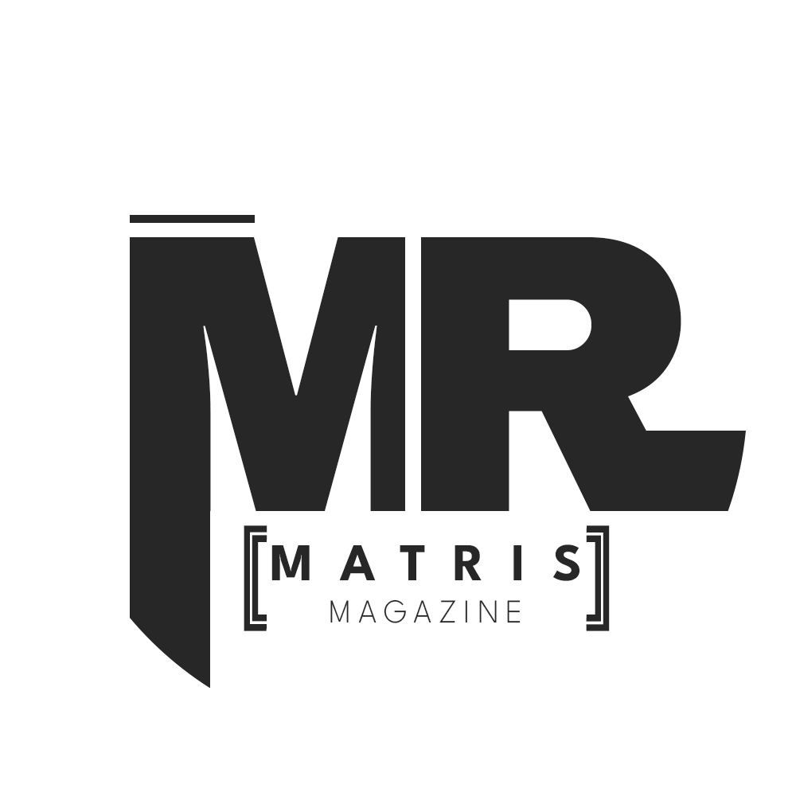

## 🐍 **سایه‌ها سرنوشت تو را نظاره می‌کنند... خوش آمدی، ای رهگذر تاریکی** 🔍🌑✨  

### **"پرده‌ی فریب را کنار زدی و اکنون، هزارتویی از اسرار پیش روی توست..."**  

  

## 🌙 **تبریک، نام رمز: [محرمانه]**  

### **تو اشباح لغزان را به حیرت انداختی.**  

در دستان تو، رمزی شکسته، همچون جواهری در سایه می‌درخشد. اما این تنها **نخستین گام** در تاروپود معمایی است که سرنوشتت را به بازی می‌گیرد. نور فریب می‌دهد، سایه حقیقت را در خود می‌پیچد. تنها با رقص آن‌ها، رازها هویدا می‌شوند. 🌑🔮  

---

## 🔥 **طلسم شکسته شد، اما دروازه همچنان در زنجیر است...**  

این مخزن، دخمه‌ای زنده است؛ جایی که هر راز، رازی نوین می‌زاید و هر گره‌ی گشوده، هزارتویی تازه می‌سازد. **حقیقت در کمین است**. در نقاطی که چشم‌ها از آن می‌گریزند، پنهان شده. تنها ذهنی تیزبین می‌تواند نجوای سایه‌ها را بخواند.  

🌪️ **هشدار:** پرده‌های تاریکی در حرکت‌اند و زمان، دشمن توست. ⏳  

---

## 🔮 **چه رازهایی در انتظارت خفته‌اند؟**  

- کدهایی که در سایه‌ها **زمزمه می‌کنند** و خود را بازمی‌آفرینند. 🔄  
- نشانه‌هایی که **نور و تاریکی** را به بازی می‌گیرند. 💡🌚  
- پازل‌هایی که هر پاسخ، زخمی تازه بر دل معما می‌زند. 🩸  
- آینه‌هایی که در آن، **حل‌کننده، معمار کابوس‌های نوین می‌شود.** 🎭  

---

## 🗝️ **چالش رمز: جرأت داری قدم به جلو بگذاری؟**  

**کلید در دستان توست، اما قفل کدام است؟** 🔐  

🔹 **مارهای آبی و زرد** را بیاب؛ آن‌ها نگهبان رازند. 🐍💙💛  
🔹 در عمق دیدنی‌ها، **استگانو** در سایه نجوا می‌شود. آن را دریاب. 🌑✨  
🔹 **نخستین راز** در این دخمه به تو چشمک می‌زند. آن را بخوان، رمزگشایی کن، و دروازه را بگشا. 🖼️💥  
🔹 **هشدار:** ناچیزترین نقاط و کم ارزش‌ترین مکان‌ها، عمیق‌ترین اسرار را در خود دارند. 🌟  

🔑 **آیا می‌توانی راز بعدی را از دل سایه‌ها بیرون بکشی؟**  

---

## 🌓 **پیمان خاموشی**  

این دخمه زنده است و برای بقا، باید با اسرار تغذیه شود:  

1. **هر راز گشوده، دو راز نوین می‌طلبد.** 🧩🗝️  
2. **هر تغییر، بازی را پیچیده‌تر می‌کند.** 🔄🤫  
3. **اسرار این‌جا، هرگز به بیرون راه نمی‌یابند.** *ناظران با چشمان سحرآمیز در کمین‌اند...* 👁️✨  

---

## ⚠️ **هشداری برای گستاخان**  

**اطمینان، خنجری زهرآگین است.**  
آنچه امروز می‌بینی، فردا در سایه‌های زمان دگرگون می‌شود. هر لایه‌ای که برمی‌داری، سه لایه‌ی نوین زاده می‌شود. **تکبر، طعمه‌ی سقوط توست.** 🗡️🐍💀  

---

## 🔥 **دروازه باز است. جرأت عبور داری؟**  

**به رمز بپیوند، یا در تاریکی گم شو.** 🏃‍♂️💨  

🕶️🐍 *صداها نجوا می‌کنند: "راز را در ناچیزترین نقطه بیاب... اگر شجاعتش را داری."*

